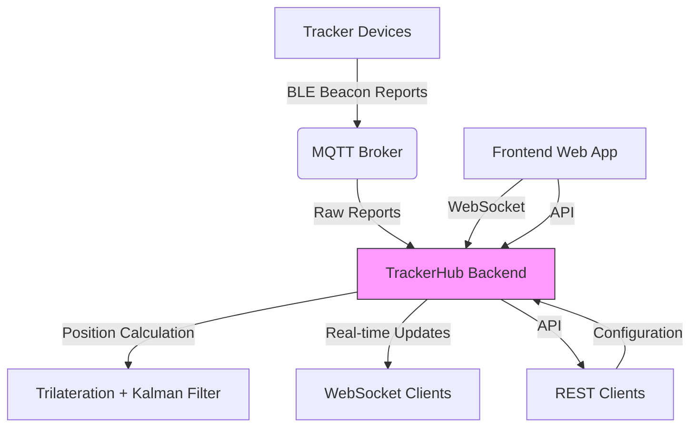

# TrackerHub

Indoor Positioning System (IPS) backend service with React frontend for real-time tracking of BLE beacon devices.

## Overview

TrackerHub is a backend service designed for indoor positioning systems using Bluetooth Low Energy (BLE) beacons. It processes BLE beacon RSSI readings from tracker devices, calculates device positions using trilateration and Kalman filtering, and provides real-time tracking data via WebSocket and REST APIs.

The system consists of:

- **Backend**: Go-based service that handles position calculation, API serving, and real-time updates
- **Frontend**: React application (currently minimal) for visualization and configuration
- **Communication**: MQTT for receiving tracker data (optional), WebSocket for real-time updates to clients, REST API for configuration

## Key Features

- 📍 **Real-time Positioning**: Calculates device positions from BLE beacon RSSI using trilateration
- 🔄 **Kalman Filtering**: Applies smoothing to position estimates for better accuracy
- 🌐 **RESTful API**: Configure beacons, maps, and system settings via HTTP
- 💧 **WebSocket Real-time Updates**: Push live tracker positions to connected clients
- 📡 **MQTT Integration**: Optional MQTT subscriber for receiving tracker reports
- 🐳 **Docker Support**: Multi-stage builds for both development and production
- 📚 **API Documentation**: Auto-generated Swagger/OpenAPI documentation
- 🛠️ **Development Tools**: Hot reload with Air (backend) and Vite (frontend)

## Technology Stack

### Backend

- **Language**: Go 1.25.6
- **Framework**: Gin Web Framework
- **Dependencies**:
  - github.com/gin-gonic/gin
  - github.com/gorilla/websocket
  - github.com/eclipse/paho.mqtt.golang
  - github.com/swaggo/swag (for API documentation)
- **Architecture**: Clean Architecture with separation of concerns

### Frontend

- **Framework**: React 19.2.7
- **Build Tool**: Vite 8.1.1
- **Styling**: Tailwind CSS 4.3.3
- **Language**: JavaScript (ESM)

### Infrastructure

- **Containerization**: Docker with multi-stage builds
- **Orchestration**: Docker Compose (development and production profiles)
- **CI/CD**: GitHub Actions for building and publishing container images

## System Architecture



## Project Structure

```
trackerhub/
├── backend/                 # Go backend service
│   ├── cmd/                # Application entry points
│   │   └── server/         # HTTP/WebSocket server
│   ├── config/             # Configuration files
│   ├── internal/           # Private application code
│   │   ├── api/            # HTTP handlers
│   │   ├── config/         # Configuration management
│   │   ├── models/         # Data structures
│   │   ├── mqtt/           # MQTT client
│   │   ├── positioning/    # Position calculation logic
│   │   └── websocket/      # WebSocket implementation
│   ├── docs/               # Swagger documentation
│   ├── Dockerfile          # Multi-stage Docker build
│   ├── go.mod              # Go dependencies
│   ├── go.sum
│   └── README.md           # Backend documentation
├── client/                 # React frontend application
│   ├── src/                # Source code
│   │   └── ...             # Components, hooks, etc.
│   ├── Dockerfile          # Multi-stage Docker build
│   ├── package.json        # NPM dependencies
│   ├── vite.config.js      # Vite configuration
│   └── README.md           # Frontend documentation
├── docker-compose-dev.yml  # Development environment
├── docker-compose-prod.yml # Production environment
├── Makefile                # Development helpers
└── README.md               # This file
```

## Prerequisites

- Docker Engine 24.0+
- Docker Compose v2+
- Go 1.25.6+ (for local development)
- Node.js 20+ (for frontend development)
- MQTT Broker (optional, for production deployment)

## Installation

### Option 1: Docker (Recommended)

1. Clone the repository:

   ```bash
   git clone https://github.com/yourusername/trackerhub.git
   cd trackerhub
   ```

2. Start the development environment:

   ```bash
   make docker-dev
   ```

   Or using docker-compose directly:

   ```bash
   docker compose -f docker-compose-dev.yml up
   ```

3. Access the services:
   - Frontend: http://localhost:3716
   - Backend API: http://localhost:8023
   - API Documentation: http://localhost:8023/swagger/index.html

### Option 2: Local Development

#### Backend

```bash
cd backend
go install github.com/air-verse/air@v1.52.2  # Hot reload tool
air  # Runs with hot reload
```

#### Frontend

```bash
cd client
npm install
npm run dev  # Vite development server
```

## Configuration

### Environment Variables

The system can be configured via environment variables or configuration files.

#### Backend Environment Variables

| Variable           | Description                          | Default     |
| ------------------ | ------------------------------------ | ----------- |
| `GO_ENV`           | Environment (development/production) | development |
| `MQTT_BROKER_HOST` | MQTT broker hostname                 | localhost   |
| `MQTT_BROKER_PORT` | MQTT broker port                     | 1883        |
| `SERVER_PORT`      | HTTP server port                     | 8022        |

#### Frontend Environment Variables

| Variable       | Description               | Default                   |
| -------------- | ------------------------- | ------------------------- |
| `VITE_API_URL` | Base URL for API requests | /api (proxied to backend) |

### Configuration Files

#### Backend

- `backend/config/server_runtime_config.json`: Server, MQTT, and Kalman filter settings
- `backend/config/web_config.json`: Map configuration, beacon positions, and UI settings

#### Frontend

- `client/vite.config.js`: Vite and Tailwind configuration

## Database

The current implementation uses in-memory storage for tracker states and configurations. No external database is required.

## MQTT Integration

The backend can optionally connect to an MQTT broker to receive tracker reports. To enable:

1. Set `MQTT_BROKER_HOST` and `MQTT_BROKER_PORT` environment variables
2. Ensure the broker is accessible and configured to publish to the expected topic
3. The subsystem is configured in `backend/internal/mqtt/mqtt.go`

## WebSocket

Real-time tracker position updates are available via WebSocket at:

- `ws://<host>:<port>/ws`

The connection emits `TrackerState` objects whenever positions are updated.

## API Documentation

The backend includes auto-generated Swagger documentation:

- Access via `/swagger/index.html` when the server is running
- Alternatively, view the generated JSON at `/swagger/doc.json`

## Build Process

### Docker Images

Backend and frontend images are built using multi-stage Dockerfiles:

```bash
# Build backend image
docker build -t trackerhub-backend -f backend/Dockerfile .

# Build frontend image
docker build -t trackerhub-frontend -f client/Dockerfile .
```

### Local Build

#### Backend

```bash
cd backend
go build -o bin/trackerhub ./cmd/server
```

#### Frontend

```bash
cd client
npm run build  # Outputs to ./dist
```

## Testing

### Backend Tests

```bash
cd backend
go test ./...
```

### Frontend Tests

_Note: Currently no test framework is configured for the frontend._

## Linting

### Backend

```bash
cd backend
golangci-lint run
```

### Frontend

```bash
cd client
npm run lint
```

## Makefile Commands

The Makefile provides convenient shortcuts:

| Command            | Description                                                      |
| ------------------ | ---------------------------------------------------------------- |
| `make help`        | Show all available targets                                       |
| `make build`       | Build backend and frontend binaries/assets                       |
| `make dev`         | Start development servers (backend with air, frontend with Vite) |
| `make docker-dev`  | Start development environment with Docker Compose                |
| `make docker-prod` | Start production environment with Docker Compose                 |
| `make test`        | Run backend and frontend tests                                   |
| `make lint`        | Run linters for both backend and frontend                        |
| `make fmt`         | Format Go and JavaScript code                                    |
| `make clean`       | Remove build artifacts                                           |

## Development Workflow

1. Start the development environment:

   ```bash
   make docker-dev
   ```

2. Make changes to the code:
   - Backend: Go files in `backend/` (auto-reloaded by Air)
   - Frontend: JS/JSX/CSS files in `client/src/` (hot-reloaded by Vite)

3. Access the running application:
   - Frontend: http://localhost:3716
   - Backend API: http://localhost:8023
   - API Docs: http://localhost:8023/swagger/index.html

## Production Deployment

1. Build production images:

   ```bash
   make docker-build
   ```

2. Start with Docker Compose:

   ```bash
   docker compose -f docker-compose-prod.yml up -d
   ```

3. The services will be available on:
   - Frontend: http://localhost (port 80)
   - Backend API: http://localhost:8022

## CI/CD

The project uses GitHub Actions for continuous integration and deployment:

- Builds Docker images for backend and frontend
- Pushes images to GitHub Container Registry (GHCR)
- Maintains only the 10 most recent image versions
- Available workflows: `.github/workflows/docker-build-publish.yml`

## Troubleshooting

### Common Issues

#### "Failed to connect to MQTT broker"

- Verify MQTT broker is running and accessible
- Check `MQTT_BROKER_HOST` and `MQTT_BROKER_PORT` environment variables
- Ensure network connectivity between the container and broker

#### "WebSocket connection failed"

- Ensure the backend is running and accessible
- Check browser console for specific error messages
- Verify the WebSocket endpoint is correct (`ws://<host>:<port>/ws`)

#### Frontend not updating

- Ensure Vite dev server is running (`npm run dev` in client directory)
- Check that file saving triggers HMR (Hot Module Replacement)
- Verify browser cache isn't serving old files (try hard refresh)

#### Backend not hot-reloading

- Ensure `air` is installed and running (check for "watching." in logs)
- Verify `.air.toml` configuration is correct
- Check file permissions in the mounted volume

## Useful Commands

```bash
# View logs for all services
docker compose -f docker-compose-dev.yml logs -f

# View logs for backend only
docker compose -f docker-compose-dev.yml logs -f backend

# View logs for frontend only
docker compose -f docker-compose-dev.yml logs -f frontend

# Restart services
docker compose -f docker-compose-dev.yml restart

# Rebuild and restart
docker compose -f docker-compose-dev.yml up --build

# Enter backend container shell
docker compose -f docker-compose-dev.yml exec backend sh

# Enter frontend container shell
docker compose -f docker-compose-dev.yml exec frontend sh
```

## Future Enhancements

Based on the current implementation, planned improvements include:

- [ ] Persistent storage for tracker history and configurations
- [ ] Admin UI for managing beacons and maps
- [ ] Enhanced visualization with map rendering
- [ ] User authentication and authorization
- [ ] Alerting and notification system
- [ ] Device management and grouping
- [ ] Export of historical tracking data

## License

This project is licensed under the MIT License - see the LICENSE file for details.

## Acknowledgments

- Gin Web Framework team
- React and Vite teams
- Tailwind CSS contributors
- Eclipse Paho MQTT library
- Swagger/OpenAPI initiative
